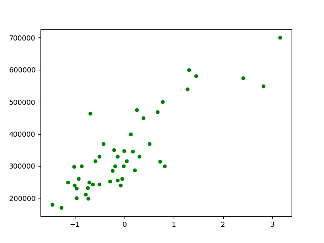
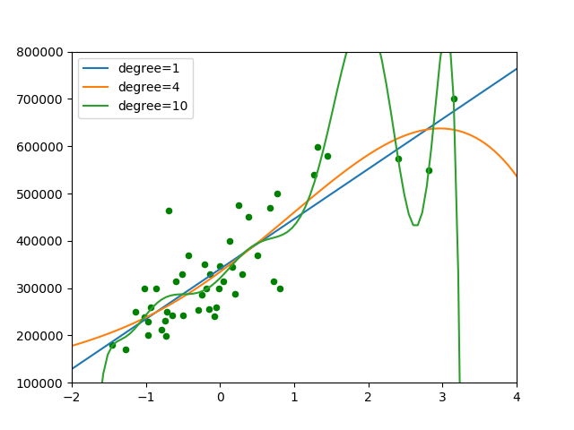

机器学习入门——线性回归
这里用一个很简单的多项式拟合的例子简单介绍机器学习的原理与实现。
## 数据
数据来自于网络git [repo](https://github.com/carefree0910/MachineLearning/blob/master/_Data/prices.txt)。通过下载数据，然后写脚本可视化看下：
~~~py
import matplotlib.pyplot as plt

x, y = [], []
for sample in open('data.txt', 'r'):
    _x, _y = sample.split(',')
    x.append(float(_x))
    y.append(float(_y))
plt.scatter(x, y, c='g', s=6)
plt.show()
~~~
得到的可视化结果为：

首先看下，加载了数据后，先将x轴的数据通过
$$X=\frac{X-\overline{X}}{std(X)}$$归一化，这样的归一化也叫Z-score归一化，得到的结果，均值为零，方差为1。
## 模型与训练
这里选择了一个简单的多项式拟合来进行，多项式拟合是线性回归的很小一部分，但是其意义比较明显，问题比较简单，这样也可以得到不错的结果。多项式拟合的数学表达为：
$$f(x|p;n)=p_0x^n+p_1x^{n-1}+...+n_{n-1}x+p_n\\L(p;n)=\frac{1}{2}[f(x|p;n)-y]^2$$其中$f(x|p;n)$就是模型，而$p,n$是模型的参数，我们需要他自己得到最优化的模型参数，所以就需要一个损失函数，让损失函数不断趋于一个特定值，让参数最优。这里的$L(p;n)$就是损失函数，可以看到，当损失函数达到最小时候，那么就是模型最优的时候。
使用多项式拟合的方法也比较简单：
~~~py
x0 = np.linspace(-2, 4, 100)
def get_model(deg):
    return lambda input_x0=x0: np.polyval(np.polyfit(x, y, deg), input_x0)
~~~
np.polyfit会返回使得$L(p;n)$最小的参数p,就是多项式的系数。np.polyval得到多项式的y。根据定义得到损失函数的表达：
~~~py
def loss(deg, input_x, input_y):
    return 0.5 * ((get_model(deg)(input_x) - input_y) ** 2).sum()
~~~
所有代码合并为：
~~~py
import numpy as np
import matplotlib.pyplot as plt

x, y = [], []
for sample in open('data.txt', 'r'):
    _x, _y = sample.split(',')
    x.append(float(_x))
    y.append(float(_y))

x, y = np.array(x), np.array(y)
x = (x - np.mean(x)) / np.std(x)

plt.scatter(x, y, c='g', s=20)

x0 = np.linspace(-2, 4, 100)

def get_model(deg):
    return lambda input_x0=x0: np.polyval(np.polyfit(x, y, deg), input_x0)

def loss(deg, input_x, input_y):
    return 0.5 * ((get_model(deg)(input_x) - input_y) ** 2).sum()

test_set = (1, 4, 10)
for d in test_set:
    plt.plot(x0, get_model(d)(), label='degree={}'.format(d))
    print(loss(d, x, y))
plt.xlim(-2, 4)
plt.ylim(1e5, 8e5)
plt.legend()
plt.savefig('images/cf.png')
plt.show()

~~~
可以看到得到的loss为:
~~~text
96732238800.35297
94112406641.67743
75874846680.09285
~~~
最后一个的损失更小，但是明显过拟合了。

