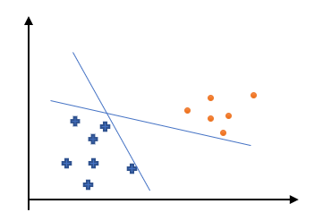
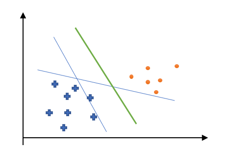

SVM
感知器能将线性可分数据集准确分割开，但是从损失函数可以看出，只是分割开了，但是没有一个最优解，比如：

这样虽然两条直线都将数据集分开了，但是如果出现了一个新的数据点，很有可能这个数据点的分割结果是错误的。比如这样：

那么就需要绿色的这个“超平面”作为分类输出才行。这个最有“超平面”就是支持向量机SVM的分类思想。
# 线性SVM
在[感知器](https://blog.csdn.net/sinat_18131557/article/details/104253484)中有描述到样本点$(x_i,y_i)$到超平面$\Pi：w·x+b=0$的相对距离为：
$$d^*(x_i,\Pi)=|w·x_i+b|$$这个也被称为函数间隔（Functional Margin）,当$w$和$b$等比例变大变小时候，超平面不会发生变化，但是$d^*$却在变大变小，为了解决这个问题，引出了几何间隔（Geometric Margin）:
$$d(x_i,\Pi)=\frac{1}{||w||}|w·x_i+b|=\frac{1}{||w||}d^*(x_i,\Pi)$$其中，$||w||$是$w$的欧式范数。SVM是让超平面到点集的距离最大化，也就是需要最大化几个间隔$d(x_i,\Pi)$,使得：
$$\frac{1}{||w||}(w·x_i+b)y_i\geqslant d(i=1,..,N)$$这里，由于在超平面两边的样本点分别分别计算$w·x_i+b$是有正有负的，而$y_i\in\{-1,+1\}$,所以能使得$(w·x_i+b)y_i$都是正数。$y_i$在这个表示的是符号。
由于$d^*=||w||d$,所以上式两边同时乘以$||w||$，问题等价为最大化$d=\frac{d^*}{||w||}$,并使得：
$$(w·x_i+b)y_i\geqslant d^*(i=1,..,N)$$可以发现$d*$的取值对优化问题的解（超平面的位置）没有影响，比如，当$d^*$变成了$\lambda d^*$,那么$w$和$b$也变成了$\lambda w$和$\lambda b$,但是超平面并没有变化。不妨假设$d^*=1$,问题转化为了最大化$\frac{1}{||w||}$使得：
$$(w·x_i+b)y_i\geqslant 1(i=1,..,N)$$由于$\frac{1}{||w||}$是非负的，最大化$\frac{1}{||w||}$，就是要最小化$||w||$,为了方便数学表达和计算，将优化问题写成最小化$\frac{1}{2}||w||^2$使得：
$$(w·x_i+b)y_i\geqslant 1(i=1,..,N)$$这就是SVM最原始的形式，如果数据集D是线性可分的，那么SVM的解就存在且唯一。

假设最优化的解为$w^*$和$b^*$,那么称超平面：
$$\Pi^*:w^*·x+b^*=0$$为最大硬间隔分离超平面。考虑到不等式的约束条件可以知道在两个平面：
$$\begin{array}{cc}
    \Pi^*_1:w^*·x+b^*=-1 \\ \Pi^*_2:w^*·x+b^*=+1
\end{array}$$中间是没有点的，因为$(w·x_i+b)y_i<1$了，但是在$\Pi^*_1$和$\Pi^*_2$上是有样本点的，通常称$\Pi^*_1$和$\Pi^*_2$为间隔边界，而边界上的点就是支持向量。

那么对于线性不可分的数据集呢？无法找到超平面完全分割数据集，更不用说要间隔最大化。就需要做出一定妥协，将“硬”间隔转化为“软”间隔，就是将不等式的条件放宽。
$$(w·x_i+b)y_i\geqslant 1\rightarrow (w·x_i+b)y_i\geqslant 1-\xi_i$$其中，$\xi_i$被称为松弛变量，不小于0。加入这个松弛变量后，损失函数需要加入一个惩罚项：
$$\mathbf{L}(w,b,x,y)=\frac{1}{2}||w||^2+C\sum_{i=1}^N\xi_i$$C被称为惩罚因子，C越大，最终SVM的模型越不能容忍误分类的点，反之越小。
到现在，SVM算法的最优化问题变为了最小化$\mathbf{L}(w,b,x,y)$,并使得：
$$(w·x_i+b)y_i\geqslant 1-\xi_i(i=1,..,N)$$其中$\xi_i\geqslant0$,所以可以定义：
$$\xi_i=l(w,b,x,y)=\max(0,1-y(w·x+b))$$其中$y\in \{-1,+1\}$,所以当模型判断不正确时候，就会有惩罚，而判断正确了就没有惩罚了。损失函数可以写为：
$$\mathbf{L}(w,b,x,y)=\frac{1}{2}||w||^2+C\sum_{i=1}^Nl(w,b,x_i,y_i)$$同样也是使用梯度下降法进行训练的，所以有偏导数：
$$\begin{array}{c}\frac{\partial L(w,b,x,y)}{\partial w}=w+\left\{\begin{array}{l}0,y_i(wx_i+b)\geqslant1\\-Cy_ix_i,y_i(wx_i+b)<1\end{array}\right.\\\frac{\partial L(w,b,x,y)}{\partial b}=\left\{\begin{array}{l}0,y_i(wx_i+b)\geqslant1\\-Cy_i,y_i(wx_i+b)<1\end{array}\right.\end{array}$$这样就可以写出线性SVM的算法实现过程：
**输入**：训练集$D=\{(x_1,y_1),...,(x_n,y_n)\}$，迭代次数M,学习率$\alpha$,其中：$$x_i\in \bold{X}\subseteq\mathbb{R^n} ,y_i\in\{-1,+1\}$$**过程：**
(1)初始化参数：$$w=(0,...,0)^T\in \mathbb{R^N},b=0$$(2)对$j=1,...,M$:
（a）算出误差向量$e=(e_1,...,e_n)^T$,其中：
$$e_i=1-y_i(w·x_i+b)$$（b）取出误差最大的一项：
$$i=\underset{i}{\argmax}e_i$$（c）若$e_i\leqslant 0$则退出循环。否则取对应样本来进行随机梯度下降：
$$ \begin{array}{cc}
    w\leftarrow (1-\alpha)w+\alpha Cy_ix_i\\b\leftarrow b+\alpha Cy_i
\end{array}
$$**输出**：线性SVM模型$g(x)=sign(f(x))=sign(w·x+b)$
# SVM算法的对偶形式
SVM的问题为：
$$\underset{w,b}{\min}L(w,b,x,y)=\frac{1}{2}||w||^2+C\sum_{i=1}^N\xi_i$$使得：
$$y_i(w·x_i+b)\geqslant1-\xi_i$$其中：$\xi_i\geqslant0$。那么原始问题的[拉格朗日函数](https://blog.csdn.net/LilyZJ/article/details/88778940)可以表达为(这里的$\alpha$不是学习率)：
$$L(w,b,\xi,\alpha,\beta)=\frac{1}{2}||w||^2+C\sum_{i=1}^N\xi_i-\sum_{i=1}^N\alpha_i[y_i(w·x_i+b)-1+\xi_i]-\sum_{i=1}^N\beta_i\xi_i$$为求解L的极小值，需要对$\alpha,\beta,\xi$求偏倒，并令为0。就有：
$$\begin{array}{l}
    \nabla_wL=w-\sum_{i=1}^N\alpha_iy_ix_i=0\\\nabla_bL=-\sum_{i=1}^N\alpha_iy_i=0\\\nabla_{\xi_i}L=C-\alpha_i-\beta_i
\end{array}$$解得：
$$\begin{array}{l}
    w=\sum_{i=1}^N\alpha_iy_ix_i\\\sum_{i=1}^N\alpha_iy_i=0
\end{array}$$以及对$j=1,...,N$都有：
$$\alpha_i+\beta_i=C$$带入计算可以得到拉格朗日函数为：
$$L(w,b,\xi,\alpha,\beta)=-\frac{1}{2}\sum_{i=1}^N\sum_{j=1}^N\alpha_i\alpha_jy_iy_j(x_i·x_j)+\sum_{i=1}^N\alpha_i$$所以原始函数的对偶问题就是求上式的最大值：
$$\underset{\alpha}{max}(-\frac{1}{2}\sum_{i=1}^N\sum_{j=1}^N\alpha_i\alpha_jy_iy_j(x_i·x_j)+\sum_{i=1}^N\alpha_i)$$约束条件为
$$\sum_{i=1}^N\alpha_iy_i=0$$以及对$j=1,...,N$都有：
$$\begin{array}{l}
    \alpha_i\geqslant0\\\beta_i\geqslant0\\\alpha_i+\beta_i=C
\end{array}$$由于和是常数，所以上述约束条件可以简化为：
$$0\leqslant\alpha_i\leqslant C$$假设对偶形式的解为:$\alpha^*=(\alpha_1,...,\alpha_N)^T$,那么：
$$\begin{array}{l}
    w^*=\sum_{i=1}^N\alpha^*_iy_ix_i \\ b^*=y_j-\sum_{i=1}^N\alpha^*_iy_i(x_i·x_j)
\end{array}$$其中$b^*$中出现的$j$是满足$0\leqslant\alpha_i\leqslant C$的下标。

训练过程从略，书中作者的代码耦合度太高，在[Jack Cui](https://cuijiahua.com/blog/2017/11/ml_8_svm_1.html)的博客上找到一份清晰的代码：

~~~python
# -*- coding:UTF-8 -*-
from time import sleep
import matplotlib.pyplot as plt
import numpy as np
import random
import types

def loadDataSet(fileName):
    dataMat = []; labelMat = []
    fr = open(fileName)
    for line in fr.readlines():                                     #逐行读取，滤除空格等
        lineArr = line.strip().split('\t')
        dataMat.append([float(lineArr[0]), float(lineArr[1])])      #添加数据
        labelMat.append(float(lineArr[2]))                          #添加标签
    return dataMat,labelMat

def selectJrand(i, m):
    j = i                                 #选择一个不等于i的j
    while (j == i):
        j = int(random.uniform(0, m))
    return j

def clipAlpha(aj,H,L):
    if aj > H:
        aj = H
    if L > aj:
        aj = L
    return aj

def smoSimple(dataMatIn, classLabels, C, toler, maxIter):
    #转换为numpy的mat存储
    dataMatrix = np.mat(dataMatIn); labelMat = np.mat(classLabels).transpose()
    #初始化b参数，统计dataMatrix的维度
    b = 0; m,n = np.shape(dataMatrix)
    #初始化alpha参数，设为0
    alphas = np.mat(np.zeros((m,1)))
    #初始化迭代次数
    iter_num = 0
    #最多迭代matIter次
    while (iter_num < maxIter):
        alphaPairsChanged = 0
        for i in range(m):
            #步骤1：计算误差Ei
            fXi = float(np.multiply(alphas,labelMat).T*(dataMatrix*dataMatrix[i,:].T)) + b
            Ei = fXi - float(labelMat[i])
            #优化alpha，更设定一定的容错率。
            if ((labelMat[i]*Ei < -toler) and (alphas[i] < C)) or ((labelMat[i]*Ei > toler) and (alphas[i] > 0)):
                #随机选择另一个与alpha_i成对优化的alpha_j
                j = selectJrand(i,m)
                #步骤1：计算误差Ej
                fXj = float(np.multiply(alphas,labelMat).T*(dataMatrix*dataMatrix[j,:].T)) + b
                Ej = fXj - float(labelMat[j])
                #保存更新前的aplpha值，使用深拷贝
                alphaIold = alphas[i].copy(); alphaJold = alphas[j].copy();
                #步骤2：计算上下界L和H
                if (labelMat[i] != labelMat[j]):
                    L = max(0, alphas[j] - alphas[i])
                    H = min(C, C + alphas[j] - alphas[i])
                else:
                    L = max(0, alphas[j] + alphas[i] - C)
                    H = min(C, alphas[j] + alphas[i])
                if L==H: print("L==H"); continue
                #步骤3：计算eta
                eta = 2.0 * dataMatrix[i,:]*dataMatrix[j,:].T - dataMatrix[i,:]*dataMatrix[i,:].T - dataMatrix[j,:]*dataMatrix[j,:].T
                if eta >= 0: print("eta>=0"); continue
                #步骤4：更新alpha_j
                alphas[j] -= labelMat[j]*(Ei - Ej)/eta
                #步骤5：修剪alpha_j
                alphas[j] = clipAlpha(alphas[j],H,L)
                if (abs(alphas[j] - alphaJold) < 0.00001): print("alpha_j变化太小"); continue
                #步骤6：更新alpha_i
                alphas[i] += labelMat[j]*labelMat[i]*(alphaJold - alphas[j])
                #步骤7：更新b_1和b_2
                b1 = b - Ei- labelMat[i]*(alphas[i]-alphaIold)*dataMatrix[i,:]*dataMatrix[i,:].T - labelMat[j]*(alphas[j]-alphaJold)*dataMatrix[i,:]*dataMatrix[j,:].T
                b2 = b - Ej- labelMat[i]*(alphas[i]-alphaIold)*dataMatrix[i,:]*dataMatrix[j,:].T - labelMat[j]*(alphas[j]-alphaJold)*dataMatrix[j,:]*dataMatrix[j,:].T
                #步骤8：根据b_1和b_2更新b
                if (0 < alphas[i]) and (C > alphas[i]): b = b1
                elif (0 < alphas[j]) and (C > alphas[j]): b = b2
                else: b = (b1 + b2)/2.0
                #统计优化次数
                alphaPairsChanged += 1
                #打印统计信息
                print("第%d次迭代 样本:%d, alpha优化次数:%d" % (iter_num,i,alphaPairsChanged))
        #更新迭代次数
        if (alphaPairsChanged == 0): iter_num += 1
        else: iter_num = 0
        print("迭代次数: %d" % iter_num)
    return b,alphas

def showClassifer(dataMat, w, b):
    #绘制样本点
    data_plus = []                                  #正样本
    data_minus = []                                 #负样本
    for i in range(len(dataMat)):
        if labelMat[i] > 0:
            data_plus.append(dataMat[i])
        else:
            data_minus.append(dataMat[i])
    data_plus_np = np.array(data_plus)              #转换为numpy矩阵
    data_minus_np = np.array(data_minus)            #转换为numpy矩阵
    plt.scatter(np.transpose(data_plus_np)[0], np.transpose(data_plus_np)[1], s=30, alpha=0.7)   #正样本散点图
    plt.scatter(np.transpose(data_minus_np)[0], np.transpose(data_minus_np)[1], s=30, alpha=0.7) #负样本散点图
    #绘制直线
    x1 = max(dataMat)[0]
    x2 = min(dataMat)[0]
    a1, a2 = w
    b = float(b)
    a1 = float(a1[0])
    a2 = float(a2[0])
    y1, y2 = (-b- a1*x1)/a2, (-b - a1*x2)/a2
    plt.plot([x1, x2], [y1, y2])
    #找出支持向量点
    for i, alpha in enumerate(alphas):
        if alpha > 0:
            x, y = dataMat[i]
            plt.scatter([x], [y], s=150, c='none', alpha=0.7, linewidth=1.5, edgecolor='red')
    plt.show()

def get_w(dataMat, labelMat, alphas):
    alphas, dataMat, labelMat = np.array(alphas), np.array(dataMat), np.array(labelMat)
    w = np.dot((np.tile(labelMat.reshape(1, -1).T, (1, 2)) * dataMat).T, alphas)
    return w.tolist()

if __name__ == '__main__':
    dataMat, labelMat = loadDataSet('testSet.txt')
    b,alphas = smoSimple(dataMat, labelMat, 0.6, 0.001, 40)
    w = get_w(dataMat, labelMat, alphas)
    showClassifer(dataMat, w, b)
~~~

# 非线性SVM

由于对偶形式中的样本点仅以内积的形式出现，所以利用核技巧能将线性算法“升级”为非线性算法。简单一点来说，就是一个低维的线性不可分的数据映射到一个维空间，并期望映射后的数据集在高维空间是线性可分的。比方说有二维的数据点是不可线性分割的，但是将这些点添加一个Z轴坐标后，就完全可能是线性可分的。
在1965年提出的Cover定理表述了：若设$d$维空间中$N$个点线性可分的概率$p(d,N)$为：
$$p(d,N)=\frac{2\sum_{i=0}^mC_{N-1}^i}{2^N}=\left\{\begin{array}{r}
    \frac{\sum_{i=1}^dC_{N-1}^i}{2^N}, & N>d+1\\1,&N\leqslant d+1
\end{array}\right.$$其中
$$m=\min(d,N-1)$$不证明了，其结论为当空间的维度$d$越大时，空间中的$N$个点被线性可分的概率越大。
那么非线性SVM的问题就转化为了如何寻找合适的映射$\phi$使得数据集在被它映射到高维空间后线性可分，直接构造一个恰当的映射$\phi$非常困难，核技巧通过**核函数**来避免显式定义映射$\phi$,就是通过核函数：
$$K(x_i,x_j)=\phi(x_i)·\phi(x_j)$$替换式子中出现的内积$x_i·x_j$完成从低维到高维的映射过程。总结来说：
 - 将算法表述为样本点内积的组合（对偶形式）；
 - 设法找到核函数$K(x_i,x_j)$,它能使样本点$x_i, x_j$被$\phi$作用后的内积；
 - 用$K(x_i,x_j)$替换$x_i·x_j$，完成从低维到高维的映射。

前人已经证明过，核函数需要满足Mercer定理。证明与原理稍显复杂，我跳过了，给出了两个核函数：
 - 多项式核：$K(x_i,x_j)=(x_i·x_j+1)^p$
 - 径向基(Radial Basis Function, RBF)核：$K(x_i,x_j)=\exp(-\gamma||x_i-x_j||^2)$

书中作者的代码耦合度太高，在[Jack Cui](https://cuijiahua.com/blog/2017/11/ml_8_svm_2.html)的博客上找到一份清晰的代码：
~~~python
# -*-coding:utf-8 -*-
import matplotlib.pyplot as plt
import numpy as np
import random

class optStruct:
    """
    数据结构，维护所有需要操作的值
    Parameters：
        dataMatIn - 数据矩阵
        classLabels - 数据标签
        C - 松弛变量
        toler - 容错率
        kTup - 包含核函数信息的元组,第一个参数存放核函数类别，第二个参数存放必要的核函数需要用到的参数
    """
    def __init__(self, dataMatIn, classLabels, C, toler, kTup):
        self.X = dataMatIn                                #数据矩阵
        self.labelMat = classLabels                        #数据标签
        self.C = C                                         #松弛变量
        self.tol = toler                                 #容错率
        self.m = np.shape(dataMatIn)[0]                 #数据矩阵行数
        self.alphas = np.mat(np.zeros((self.m,1)))         #根据矩阵行数初始化alpha参数为0   
        self.b = 0                                         #初始化b参数为0
        self.eCache = np.mat(np.zeros((self.m,2)))         #根据矩阵行数初始化虎误差缓存，第一列为是否有效的标志位，第二列为实际的误差E的值。
        self.K = np.mat(np.zeros((self.m,self.m)))        #初始化核K
        for i in range(self.m):                            #计算所有数据的核K
            self.K[:,i] = kernelTrans(self.X, self.X[i,:], kTup)

def kernelTrans(X, A, kTup):
    """
    通过核函数将数据转换更高维的空间
    Parameters：
        X - 数据矩阵
        A - 单个数据的向量
        kTup - 包含核函数信息的元组
    Returns:
        K - 计算的核K
    """
    m,n = np.shape(X)
    K = np.mat(np.zeros((m,1)))
    if kTup[0] == 'lin': K = X * A.T                       #线性核函数,只进行内积。
    elif kTup[0] == 'rbf':                                 #高斯核函数,根据高斯核函数公式进行计算
        for j in range(m):
            deltaRow = X[j,:] - A
            K[j] = deltaRow*deltaRow.T
        K = np.exp(K/(-1*kTup[1]**2))                     #计算高斯核K
    else: raise NameError('核函数无法识别')
    return K                                             #返回计算的核K

def loadDataSet(fileName):
    """
    读取数据
    Parameters:
        fileName - 文件名
    Returns:
        dataMat - 数据矩阵
        labelMat - 数据标签
    """
    dataMat = []; labelMat = []
    fr = open(fileName)
    for line in fr.readlines():                                     #逐行读取，滤除空格等
        lineArr = line.strip().split('\t')
        dataMat.append([float(lineArr[0]), float(lineArr[1])])      #添加数据
        labelMat.append(float(lineArr[2]))                          #添加标签
    return dataMat,labelMat

def calcEk(oS, k):
    """
    计算误差
    Parameters：
        oS - 数据结构
        k - 标号为k的数据
    Returns:
        Ek - 标号为k的数据误差
    """
    fXk = float(np.multiply(oS.alphas,oS.labelMat).T*oS.K[:,k] + oS.b)
    Ek = fXk - float(oS.labelMat[k])
    return Ek

def selectJrand(i, m):
    """
    函数说明:随机选择alpha_j的索引值

    Parameters:
        i - alpha_i的索引值
        m - alpha参数个数
    Returns:
        j - alpha_j的索引值
    """
    j = i                                 #选择一个不等于i的j
    while (j == i):
        j = int(random.uniform(0, m))
    return j

def selectJ(i, oS, Ei):
    """
    内循环启发方式2
    Parameters：
        i - 标号为i的数据的索引值
        oS - 数据结构
        Ei - 标号为i的数据误差
    Returns:
        j, maxK - 标号为j或maxK的数据的索引值
        Ej - 标号为j的数据误差
    """
    maxK = -1; maxDeltaE = 0; Ej = 0                         #初始化
    oS.eCache[i] = [1,Ei]                                      #根据Ei更新误差缓存
    validEcacheList = np.nonzero(oS.eCache[:,0].A)[0]        #返回误差不为0的数据的索引值
    if (len(validEcacheList)) > 1:                            #有不为0的误差
        for k in validEcacheList:                           #遍历,找到最大的Ek
            if k == i: continue                             #不计算i,浪费时间
            Ek = calcEk(oS, k)                                #计算Ek
            deltaE = abs(Ei - Ek)                            #计算|Ei-Ek|
            if (deltaE > maxDeltaE):                        #找到maxDeltaE
                maxK = k; maxDeltaE = deltaE; Ej = Ek
        return maxK, Ej                                        #返回maxK,Ej
    else:                                                   #没有不为0的误差
        j = selectJrand(i, oS.m)                            #随机选择alpha_j的索引值
        Ej = calcEk(oS, j)                                    #计算Ej
    return j, Ej                                             #j,Ej

def updateEk(oS, k):
    """
    计算Ek,并更新误差缓存
    Parameters：
        oS - 数据结构
        k - 标号为k的数据的索引值
    Returns:
        无
    """
    Ek = calcEk(oS, k)                                        #计算Ek
    oS.eCache[k] = [1,Ek]                                    #更新误差缓存

def clipAlpha(aj,H,L):
    """
    修剪alpha_j
    Parameters:
        aj - alpha_j的值
        H - alpha上限
        L - alpha下限
    Returns:
        aj - 修剪后的alpah_j的值
    """
    if aj > H:
        aj = H
    if L > aj:
        aj = L
    return aj

def innerL(i, oS):
    """
    优化的SMO算法
    Parameters：
        i - 标号为i的数据的索引值
        oS - 数据结构
    Returns:
        1 - 有任意一对alpha值发生变化
        0 - 没有任意一对alpha值发生变化或变化太小
    """
    #步骤1：计算误差Ei
    Ei = calcEk(oS, i)
    #优化alpha,设定一定的容错率。
    if ((oS.labelMat[i] * Ei < -oS.tol) and (oS.alphas[i] < oS.C)) or ((oS.labelMat[i] * Ei > oS.tol) and (oS.alphas[i] > 0)):
        #使用内循环启发方式2选择alpha_j,并计算Ej
        j,Ej = selectJ(i, oS, Ei)
        #保存更新前的aplpha值，使用深拷贝
        alphaIold = oS.alphas[i].copy(); alphaJold = oS.alphas[j].copy();
        #步骤2：计算上下界L和H
        if (oS.labelMat[i] != oS.labelMat[j]):
            L = max(0, oS.alphas[j] - oS.alphas[i])
            H = min(oS.C, oS.C + oS.alphas[j] - oS.alphas[i])
        else:
            L = max(0, oS.alphas[j] + oS.alphas[i] - oS.C)
            H = min(oS.C, oS.alphas[j] + oS.alphas[i])
        if L == H:
            print("L==H")
            return 0
        #步骤3：计算eta
        eta = 2.0 * oS.K[i,j] - oS.K[i,i] - oS.K[j,j]
        if eta >= 0:
            print("eta>=0")
            return 0
        #步骤4：更新alpha_j
        oS.alphas[j] -= oS.labelMat[j] * (Ei - Ej)/eta
        #步骤5：修剪alpha_j
        oS.alphas[j] = clipAlpha(oS.alphas[j],H,L)
        #更新Ej至误差缓存
        updateEk(oS, j)
        if (abs(oS.alphas[j] - alphaJold) < 0.00001):
            print("alpha_j变化太小")
            return 0
        #步骤6：更新alpha_i
        oS.alphas[i] += oS.labelMat[j]*oS.labelMat[i]*(alphaJold - oS.alphas[j])
        #更新Ei至误差缓存
        updateEk(oS, i)
        #步骤7：更新b_1和b_2
        b1 = oS.b - Ei- oS.labelMat[i]*(oS.alphas[i]-alphaIold)*oS.K[i,i] - oS.labelMat[j]*(oS.alphas[j]-alphaJold)*oS.K[i,j]
        b2 = oS.b - Ej- oS.labelMat[i]*(oS.alphas[i]-alphaIold)*oS.K[i,j]- oS.labelMat[j]*(oS.alphas[j]-alphaJold)*oS.K[j,j]
        #步骤8：根据b_1和b_2更新b
        if (0 < oS.alphas[i]) and (oS.C > oS.alphas[i]): oS.b = b1
        elif (0 < oS.alphas[j]) and (oS.C > oS.alphas[j]): oS.b = b2
        else: oS.b = (b1 + b2)/2.0
        return 1
    else:
        return 0

def smoP(dataMatIn, classLabels, C, toler, maxIter, kTup = ('lin',0)):
    """
    完整的线性SMO算法
    Parameters：
        dataMatIn - 数据矩阵
        classLabels - 数据标签
        C - 松弛变量
        toler - 容错率
        maxIter - 最大迭代次数
        kTup - 包含核函数信息的元组
    Returns:
        oS.b - SMO算法计算的b
        oS.alphas - SMO算法计算的alphas
    """
    oS = optStruct(np.mat(dataMatIn), np.mat(classLabels).transpose(), C, toler, kTup)                #初始化数据结构
    iter = 0                                                                                         #初始化当前迭代次数
    entireSet = True; alphaPairsChanged = 0
    while (iter < maxIter) and ((alphaPairsChanged > 0) or (entireSet)):                            #遍历整个数据集都alpha也没有更新或者超过最大迭代次数,则退出循环
        alphaPairsChanged = 0
        if entireSet:                                                                                #遍历整个数据集                           
            for i in range(oS.m):       
                alphaPairsChanged += innerL(i,oS)                                                    #使用优化的SMO算法
                print("全样本遍历:第%d次迭代 样本:%d, alpha优化次数:%d" % (iter,i,alphaPairsChanged))
            iter += 1
        else:                                                                                         #遍历非边界值
            nonBoundIs = np.nonzero((oS.alphas.A > 0) * (oS.alphas.A < C))[0]                        #遍历不在边界0和C的alpha
            for i in nonBoundIs:
                alphaPairsChanged += innerL(i,oS)
                print("非边界遍历:第%d次迭代 样本:%d, alpha优化次数:%d" % (iter,i,alphaPairsChanged))
            iter += 1
        if entireSet:                                                                                #遍历一次后改为非边界遍历
            entireSet = False
        elif (alphaPairsChanged == 0):                                                                #如果alpha没有更新,计算全样本遍历
            entireSet = True 
        print("迭代次数: %d" % iter)
    return oS.b,oS.alphas                                                                             #返回SMO算法计算的b和alphas

def testRbf(k1 = 1.3):
    """
    测试函数
    Parameters:
        k1 - 使用高斯核函数的时候表示到达率
    Returns:
        无
    """
    dataArr,labelArr = loadDataSet('testSetRBF.txt')                        #加载训练集
    b,alphas = smoP(dataArr, labelArr, 200, 0.0001, 100, ('rbf', k1))        #根据训练集计算b和alphas
    datMat = np.mat(dataArr); labelMat = np.mat(labelArr).transpose()
    svInd = np.nonzero(alphas.A > 0)[0]                                        #获得支持向量
    sVs = datMat[svInd]                                                     
    labelSV = labelMat[svInd];
    print("支持向量个数:%d" % np.shape(sVs)[0])
    m,n = np.shape(datMat)
    errorCount = 0
    for i in range(m):
        kernelEval = kernelTrans(sVs,datMat[i,:],('rbf', k1))                #计算各个点的核
        predict = kernelEval.T * np.multiply(labelSV,alphas[svInd]) + b     #根据支持向量的点，计算超平面，返回预测结果
        if np.sign(predict) != np.sign(labelArr[i]): errorCount += 1        #返回数组中各元素的正负符号，用1和-1表示，并统计错误个数
    print("训练集错误率: %.2f%%" % ((float(errorCount)/m)*100))             #打印错误率
    dataArr,labelArr = loadDataSet('testSetRBF2.txt')                         #加载测试集
    errorCount = 0
    datMat = np.mat(dataArr); labelMat = np.mat(labelArr).transpose()         
    m,n = np.shape(datMat)
    for i in range(m):
        kernelEval = kernelTrans(sVs,datMat[i,:],('rbf', k1))                 #计算各个点的核           
        predict=kernelEval.T * np.multiply(labelSV,alphas[svInd]) + b         #根据支持向量的点，计算超平面，返回预测结果
        if np.sign(predict) != np.sign(labelArr[i]): errorCount += 1        #返回数组中各元素的正负符号，用1和-1表示，并统计错误个数
    print("测试集错误率: %.2f%%" % ((float(errorCount)/m)*100))             #打印错误率

def showDataSet(dataMat, labelMat):
    """
    数据可视化
    Parameters:
        dataMat - 数据矩阵
        labelMat - 数据标签
    Returns:
        无
    """
    data_plus = []                                  #正样本
    data_minus = []                                 #负样本
    for i in range(len(dataMat)):
        if labelMat[i] > 0:
            data_plus.append(dataMat[i])
        else:
            data_minus.append(dataMat[i])
    data_plus_np = np.array(data_plus)              #转换为numpy矩阵
    data_minus_np = np.array(data_minus)            #转换为numpy矩阵
    plt.scatter(np.transpose(data_plus_np)[0], np.transpose(data_plus_np)[1])   #正样本散点图
    plt.scatter(np.transpose(data_minus_np)[0], np.transpose(data_minus_np)[1]) #负样本散点图
    plt.show()

if __name__ == '__main__':
    testRbf()
~~~

# 多分类
## 一对多方法（One-vs-Rest,OvR）
对于K类问题，训练K个二分类模型$\{G_1,...,G_K\}$，其中，模型$G_i$在训练时候，只识别第i类标签，其他类别都认为是负样本。训练好K个模型时候，直接输出最大的对应的类别标签：
$$y_{pred}=\arg\underset{i}{\max}G_i(x)$$这样在训练时候，会样本不均衡，一般都在负样本中取一部分来训练，而不是用负样本的全部。

## 一对一方法(One-vs-One,OvO)
对于一个k类问题，直接训练$\frac{K(K-1)}{2}$个二分类模型$\{G_{12},G_{13},...,G_{1K},G_{23},G_{24},...,G_{2K},...,G_{K-1,K}\}$，每个模型都只接受两类样本的训练，训练的结果标签只需要$\{-1,+1\}$,即可投票即可，那么所有模型训练好了，只需要让所有模型投票，就可以确定多分类的结果。

## 有向无环图方法(Directed Acyclic Graph Method,DAG)
DAG训练过程与OvO是一样的，只是区别于最后的决策过程。